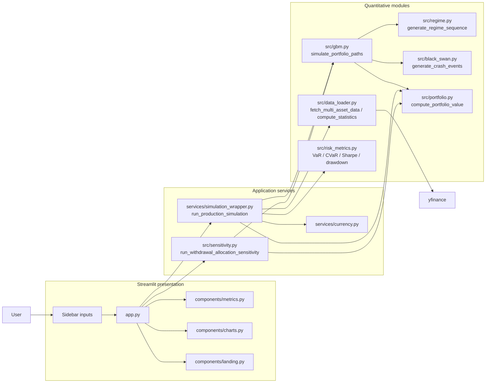
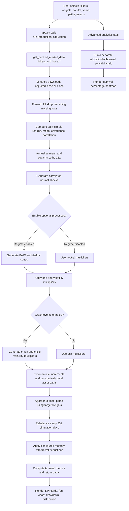
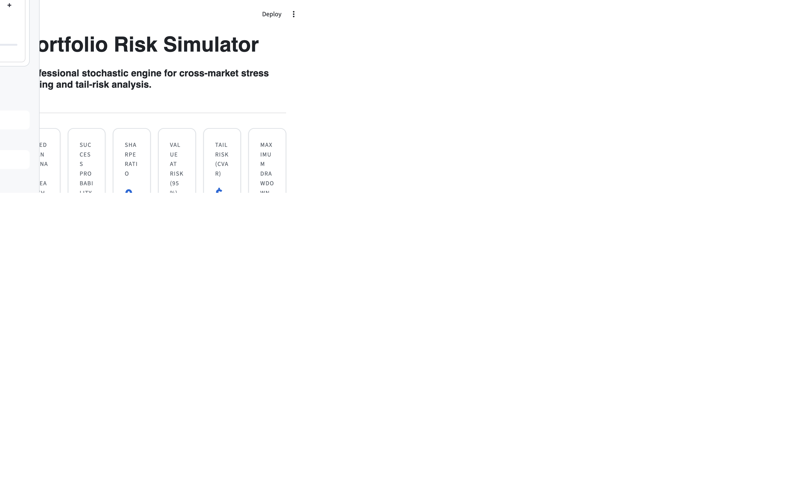
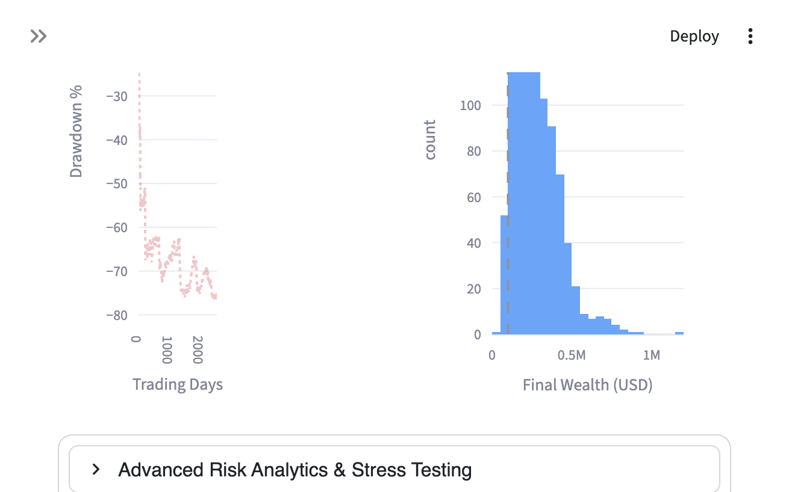
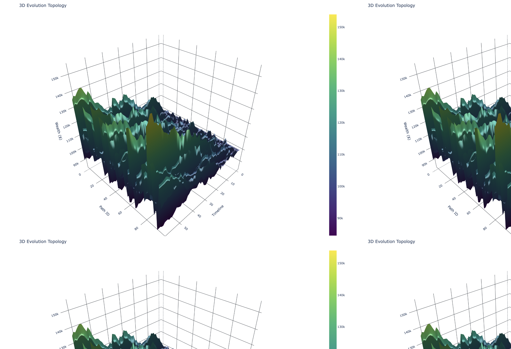

# Portfolio Oracle
### A Stochastic Portfolio Simulator and Risk-Analysis Workbench


Portfolio Oracle estimates a distribution of possible portfolio paths from historical asset-return estimates. It combines correlated geometric Brownian motion (GBM) with optional two-state market regimes and clustered systemic crash events, then aggregates asset paths into a rebalanced portfolio and computes terminal-value and path-risk statistics.

This is a quantitative simulation application, not a forecasting model or an investment optimizer. It does not train machine-learning models, infer optimal allocations, or claim that simulated probabilities are calibrated forecasts.

## Overview

A deterministic projection applies one assumed return path and produces one terminal value. Monte Carlo simulation repeatedly samples shocks from estimated return parameters and produces many possible paths. The resulting distribution makes dispersion and downside outcomes visible, but it remains conditional on the historical estimates and model assumptions supplied to it.

The primary interface is a Streamlit application. Its controls select tickers, weights, initial capital, horizon, withdrawal amount, path count, and whether the regime and crash-event features are enabled.

## Key Capabilities

| Capability | Current implementation |
|---|---|
| Market data | `yfinance` download of adjusted close prices when available, with close-price fallback; forward-fill and drop rows that still contain missing values. A Streamlit-cached market-data function also stores downloaded prices in `data/multi_asset_historical.csv`. |
| Parameter estimation | Arithmetic daily `pct_change()` mean, sample covariance, and sample correlation via pandas. The latest available price initializes each simulated asset. |
| Portfolio simulation | NumPy GBM paths with correlated normal shocks; output shape is `(days, assets, simulations)`. |
| Correlation modeling | Historical covariance passed through Cholesky factorization; a positive-semidefinite eigenvalue fallback handles singular covariance matrices. |
| Regime modeling | Optional two-state Bull/Bear Markov chain with configured transition probabilities and separate drift and volatility multipliers. |
| Tail events | Optional shared portfolio-wide crash multipliers, Poisson-sampled initial events, bounded event counts, crisis windows, and elevated volatility during crisis periods. |
| Portfolio accounting | Weighted buy-and-hold asset shares, with periodic rebalancing in the production wrapper (252 trading-day interval). |
| Risk outputs | Median terminal wealth, 95% VaR and CVaR, annualized Sharpe ratio, worst path maximum drawdown, and final-positive-value rate. |
| Sensitivity analysis | Grid over stock allocation and monthly withdrawals; reports the fraction of simulated terminal values above zero. |
| Visualization | Streamlit/Plotly fan chart, drawdown chart, terminal-value histogram, 3D path surface, historical correlation table, and withdrawal/allocation heatmap. |

## Why Monte Carlo?

```text
Historical prices
       |
       v
Daily return estimates and covariance
       |
       v
Correlated stochastic asset paths
       |
       v
Portfolio aggregation and periodic rebalancing
       |
       v
Terminal-value distribution and path-risk metrics
       |
       v
Interactive charts and sensitivity grid
```

An expected return alone does not describe the range of outcomes, cross-asset dependence, or interim declines. Sampling paths provides a way to inspect those quantities under explicit assumptions. It does not eliminate estimation error, model risk, or uncertainty about future market behavior.

## System Architecture

The modules below follow the current import and call structure; the diagram is derived from the implementation rather than a target design.



`app.py` owns the Streamlit page and user workflow. `services/simulation_wrapper.py` orchestrates cached data, annualization, simulation, portfolio aggregation, withdrawals, and the metrics returned to the UI. The quantitative calculations live under `src/`; presentation components construct Plotly figures and metric cards. Sensitivity analysis is invoked separately from the primary simulation service.

## Simulation / Execution Pipeline



The data fetch requires network access when its cached result is unavailable. The included `data/multi_asset_historical.csv` is a local downloaded-data artifact, not an automatic offline fallback in `fetch_multi_asset_data()`.

## Mathematical Foundation

### Correlated GBM

For asset $i$, the continuous-time model is:

$$dS_i(t) = \mu_i S_i(t)\,dt + \sigma_i S_i(t)\,dW_i(t).$$

The implementation advances log prices with an exponential Euler step:

$$S_{t+1,i} = S_{t,i}\exp\left[\left(\mu_{t,i} - \frac{1}{2}\sigma_{t,i}^{2}\right)\Delta t + \sqrt{\Delta t}\,\epsilon_{t,i}\right].$$

Here $\mu$ is the annualized arithmetic daily-return mean supplied by `compute_statistics()`, $\sigma_i^2$ is the corresponding covariance diagonal, and $\Delta t=1/252$ in the production wrapper. `src/gbm.py` draws standard-normal innovations with NumPy and transforms them by a covariance factor. If $Z\sim N(0,I)$ and $\Sigma=LL^T$, then $\epsilon=LZ$ has covariance $\Sigma$. Cholesky is used for positive-definite matrices; an eigenvalue factor is used for positive-semidefinite matrices. An epsilon diagonal adjustment is attempted only for a materially non-PSD input.

The engine is vectorized over assets and simulations. It builds cumulative products across time rather than stepping each path in Python. Generated asset prices remain positive under the GBM component; crash multipliers can produce downward gaps but are positive under the configured drop range.

### Return and covariance estimates

For historical prices $P_t$, the loader computes simple daily returns $r_t=P_t/P_{t-1}-1$. The drift estimate is the column mean of these returns, and the covariance/correlation estimates use pandas sample statistics. The service multiplies the mean and covariance by 252 before simulation. The latest row's prices become $S_0$.

This is a constant-covariance baseline: correlations are estimated once from history and do not evolve with time. Regime and crisis volatility multipliers change the scale of diffusion but do not estimate new regime-specific covariance matrices.

### Bull/Bear Markov regimes

`src/regime.py` evolves a two-state chain, with state 0 initialized as Bull and state 1 representing Bear. The configured transition matrix is:

$$P = \begin{bmatrix}0.99 & 0.01\\0.03 & 0.97\end{bmatrix}.$$

At each transition, the implementation draws a uniform random value and compares it with the current state's probability of entering Bear. The default configuration multiplies drift by 1.2 in Bull and 0.8 in Bear; diffusion volatility is multiplied by 0.9 and 1.4 respectively. When regime switching is disabled, the state output is zero and both multipliers are one.

### Crash events and crisis windows

`src/black_swan.py` implements a systemic event overlay, not a calibrated jump-diffusion model. Per simulation, it samples an initial event count from a Poisson distribution with default $\lambda=1$, capped at three events and by the number of available time steps. Event dates are sampled from the horizon; each event applies a common return multiplier to all assets, with a drop drawn uniformly from 15% to 35%.

After an event, the path enters a crisis window of 10-30 trading days by default. During a crisis, the configured daily cascade probability is 0.005, total events remain capped at three, and the diffusion volatility multiplier is 2.0. These are hand-configured scenario assumptions, not parameters inferred from a fitted extreme-value or Hawkes-process model.

## Quantitative Engine

`generate_correlated_randoms()` allocates independent shocks with shape `(days - 1, assets, simulations)`, factors them by the supplied covariance matrix, and passes the result to the GBM update. `simulate_portfolio_paths()` applies regime scaling, optional crisis volatility, and shared crash multipliers before exponentiation and cumulative compounding. The returned arrays are asset prices, regime states, and crash multipliers.

`compute_portfolio_value()` converts initial capital and target weights into asset shares. Between rebalances, it values those shares against the simulated asset prices. When `rebalance_freq_days` is positive, it resets holdings to the target weights at each matching timestep. The production wrapper uses 252 days, so the intended interval is approximately annual.

The primary wrapper applies monthly withdrawal deductions every 21 steps, but it subtracts from the displayed portfolio value without carrying the reduced capital into later portfolio-path calculations. As a result, after-withdrawal paths and their reported risks are not a faithful recurring-cash-flow simulation; interpret withdrawal results with that limitation in mind. The separate sensitivity implementation does carry its adjusted balance forward using the original path's daily returns, but it defines success using only terminal adjusted value above zero.

## Risk Engine

All terminal-value metrics are computed over the simulated final portfolio values. Dollar losses are floored at zero, so gains above initial capital do not appear as negative VaR or CVaR.

### Value at Risk

For confidence level $c=0.95$, the code takes the fifth percentile of final wealth and reports the nonnegative difference from initial capital:

$$\operatorname{VaR}_{95}=\max\left(0,V_0-Q_{0.05}(V_T)\right).$$

This is an absolute-dollar terminal-wealth loss relative to initial capital, not a percentage return quantile.

### Conditional Value at Risk

The implementation averages final values at or below the fifth-percentile threshold and subtracts that mean from initial capital:

$$\operatorname{CVaR}_{95}=\max\left(0,V_0-\mathbb{E}[V_T\mid V_T\leq Q_{0.05}(V_T)]\right).$$

### Maximum drawdown

For each path, the risk module compares wealth with its running peak and finds the most negative relative decline:

$$D_{\max}^{(s)}=\min_t\left(\frac{V_{t,s}}{\max_{u\leq t}V_{u,s}}-1\right).$$

`compute_drawdowns()` returns the average and worst per-path drawdown as negative fractions. The production service exposes the magnitude of the worst path as `max_drawdown`.

### Sharpe ratio

`compute_sharpe_ratio()` calculates simple returns between adjacent portfolio values, pools the returns over all timesteps and paths, subtracts the per-period risk-free rate (zero by default), and annualizes using 252 periods:

$$\operatorname{Sharpe}=\sqrt{252}\,\frac{\operatorname{mean}(r-r_f/252)}{\operatorname{std}(r-r_f/252)}.$$

This is a pooled path/time statistic; the code does not estimate a separate Sharpe ratio for every path.

### Success rate and probability of loss

The production service's `success_rate` is the percentage of terminal portfolio values strictly greater than zero. It is not a pathwise no-ruin test. With no withdrawals, positive GBM paths make this measure 100% by construction for ordinary positive weights. The sensitivity grid likewise counts positive terminal adjusted balances, not paths that stayed above zero throughout.

Probability of loss is not a named engine metric; for the numerical run below it is calculated as the fraction of final values below the initial investment. It is distinct from the service's terminal-positive `success_rate`.

## Actual Numerical Results

The following results were produced from a reproducible local run on 2026-09-27. The input estimates came from the bundled `data/multi_asset_historical.csv` (SPY, AGG, GLD; 2016-04-04 through 2026-03-30). The production wrapper was run with NumPy seed `20260927`, 5,000 simulations, a 10-year horizon, $100,000 initial capital, no withdrawals, and both regime switching and crash events enabled. Runtime is measured around the simulation service call after loading the local data.

| Metric | Result |
|---|---:|
| Assets | 3 (SPY, AGG, GLD) |
| Simulation paths | 5,000 |
| Horizon | 10 years (2,520 path rows) |
| Initial capital | $100,000 |
| Median terminal value | $233,859.38 |
| 5th percentile | $99,163.30 |
| 25th percentile | $164,643.47 |
| 75th percentile | $319,640.13 |
| 95th percentile | $495,115.16 |
| Annualized pooled Sharpe ratio | 0.64 |
| 95% VaR | $836.70 |
| 95% CVaR | $18,683.54 |
| Worst path maximum drawdown | 79.27% |
| Probability of loss (terminal value below $100,000) | 5.08% |
| Engine success rate (terminal value above zero) | 100.00% |
| Runtime | 1.283 s |

These figures are one seeded model run, not a forecast or a promise of future performance. The 100% success rate reflects the engine's terminal-positive definition and this run's no-withdrawal configuration; it should not be interpreted as a 100% probability of avoiding interim losses.

## Application Screenshots

These images were captured from the running Streamlit application. The landing page's illustrative demo charts are intentionally not shown as simulation results.

### Simulation dashboard



The dashboard screenshot shows the actual KPI cards and charts produced by a live UI run. Its random seed and online data response differ from the reproducible table above.

### Allocation and withdrawal sensitivity



The heatmap compares configured stock weights with monthly withdrawal amounts. Cells show the percentage of simulated terminal adjusted balances greater than zero; they do not measure pathwise survival.

### 3D wealth-path surface



This is the actual `plot_3d_topology()` component rendered from 100 seeded GBM portfolio paths using the bundled market estimates; the app's advanced analytics tab uses the same component.

## Output Analysis

The fan chart calculates 5th, 25th, 50th, 75th, and 95th percentiles independently at every trading-day row. Its outer and inner bands summarize the spread of simulated portfolio values; they are not confidence intervals for an estimated parameter.

The terminal histogram shows the final portfolio-value distribution with vertical references for initial capital and the median. The drawdown chart shows the cross-path median drawdown and the worst drawdown observed at each day. The correlation table in the advanced panel is the historical sample correlation from the data-estimation step; it is not a correlation matrix re-estimated from the simulated portfolio outcomes.

The optional 3D surface plots up to 100 portfolio paths and downsamples the time axis to at most roughly 60 rows for display. It is a path visualization, not a surface of portfolio variance. Regime states are returned by the engine but are not currently plotted in the application. Crash-event counts are printed to the Streamlit server log; there is no dedicated regime or crash analytics chart in the current UI.

## Sensitivity Analysis

`src/sensitivity.py` evaluates a grid with stock allocations as rows and monthly withdrawal amounts as columns. In `app.py`, the stock allocation levels are 20%, 40%, 60%, 80%, and 100%; withdrawal levels range from zero to 10% of initial capital across five values. Non-stock weights are rescaled proportionally from the base allocation to fill the remaining weight.

For each stock-allocation row, the engine generates a new Monte Carlo universe, rebalances the sensitivity portfolio every 21 days, then evaluates withdrawal-adjusted terminal balances. It reuses that row's asset paths across the withdrawal columns. The heatmap's color/value is the share of terminal balances above zero, not probability of maintaining a positive balance at every intermediate date. Sensitivity paths use `max(100, num_simulations // 10)` simulations, so this view is lower-density than the primary run.

## Performance and Scalability

The core GBM path update uses NumPy broadcasting, `einsum`, and cumulative products. Its dominant array dimensions are proportional to trading days $T$, assets $A$, and simulations $N$, so storage and work scale approximately as $O(TAN)$. Several full-size intermediate arrays coexist during path generation; peak resident memory is therefore materially larger than the returned price tensor alone. Regime generation and crash-event logic also contain Python loops over timesteps or simulations.

Measured on an Apple M5 with 16 GiB RAM, Python 3.9.6, using the bundled three-asset estimates, one-year horizon (252 rows), and events/regimes disabled. Runtime is the engine call measured with `time.perf_counter()`; peak RSS is the isolated Python process's `/usr/bin/time -l` maximum resident set size.

| Paths | Assets | Horizon | Engine runtime | Peak process RSS |
|---:|---:|---:|---:|---:|
| 10,000 | 3 | 252 rows (1 year) | 0.227 s | 770 MiB |
| 50,000 | 3 | 252 rows (1 year) | 1.529 s | 2.77 GiB |
| 100,000 | 3 | 252 rows (1 year) | 3.326 s | 3.57 GiB |

These are single local measurements, not service-level guarantees. Longer horizons multiply memory use, and the dashboard currently limits path counts to 500-5,000 while allowing horizons up to 30 years. The service does not stream or batch paths, so large path/horizon combinations can require substantial memory.

Historical-data retrieval is cached with Streamlit's `cache_data`; simulation paths themselves are not cached. The data cache has no configured time-to-live in `get_cached_market_data()`.

## Configuration, Assumptions, and Limitations

- The `Market Focus` control is passed to the service but is not used to transform tickers. `format_ticker()` exists in `services/currency.py` but is not called by the app; enter valid provider symbols directly.
- The currency-rate helper in `services/currency.py` references `pd.MultiIndex` without importing pandas. When the downloaded result reaches that branch, the exception is caught and the function falls back to 83.0 INR/USD. This fallback was observed during the live application run.
- The production withdrawal deduction does not carry reduced capital forward into future portfolio values, as detailed above. Withdrawal/survival output should be treated as approximate until the path accounting is corrected.
- Drift and covariance use historical daily simple-return estimates, annualized by multiplication by 252. They are treated as fixed model inputs over the projection.
- Crash severity, crash frequency, crisis duration, cascade probability, regime transition probabilities, and regime multipliers are configuration constants, not calibrated to a specified stress dataset.
- The primary simulation uses ordinary pseudorandom draws from NumPy's global random generator. The UI does not expose a seed, so interactive runs are not reproducible by configuration alone.
- VaR/CVaR are dollar gaps from initial capital. Neither includes a distribution of return percentages or a modeled risk-free/cash asset unless the user includes one among the tickers.
- No transaction costs, taxes, liquidity constraints, stochastic volatility process, factor model, asset-allocation optimizer, or trained ML model is implemented.
- This project is for research and educational use, not financial advice.

## Installation and Usage

```bash
git clone https://github.com/ishwari05/montevision.git
cd montevision
python3 -m pip install -r requirements.txt
streamlit run app.py
```

The application opens in a browser. The first uncached run requires network access for market data and the USD/INR lookup. The sidebar checks that ticker and weight counts match. If weights differ from a total of one by more than 0.01, it warns and normalizes them; totals within that band pass through unchanged, although portfolio accounting requires `np.isclose(sum(weights), 1.0)` and can reject them. Black Swan modeling and regime switching are enabled by default.

Run the tests with:

```bash
python3 -m pytest -q
```

The test suite covers GBM output shape/positivity, covariance behavior and correlation, deterministic zero-volatility compounding, standard-error scaling, portfolio aggregation/rebalancing, risk metrics, service outputs, and currency fallback behavior.

## Repository Structure

```text
montevision/
├── app.py
├── components/
│   ├── charts.py
│   ├── landing.py
│   └── metrics.py
├── data/
│   ├── multi_asset_historical.csv
│   ├── risk_summary.csv
│   ├── sensitivity_matrix.csv
│   ├── SPY_historical_prices.csv
│   └── *.png                  # Existing chart exports; not all are rendered by app.py
├── docs/
│   └── images/                # Captured live application screenshots
├── services/
│   ├── currency.py
│   └── simulation_wrapper.py
├── src/
│   ├── black_swan.py
│   ├── data_loader.py
│   ├── gbm.py
│   ├── portfolio.py
│   ├── regime.py
│   ├── risk_metrics.py
│   └── sensitivity.py
├── tests/
│   ├── test_currency_hardened.py
│   ├── test_gbm.py
│   ├── test_portfolio.py
│   ├── test_risk_metrics.py
│   └── test_simulation_services.py
├── pytest.ini
└── requirements.txt
```
